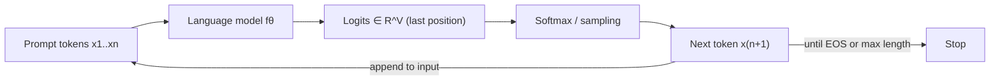
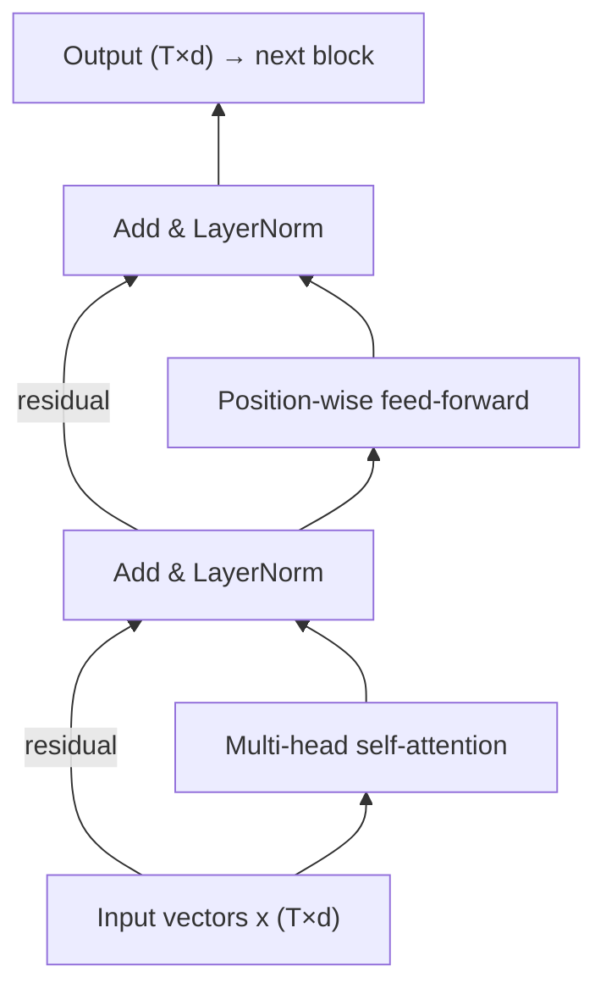
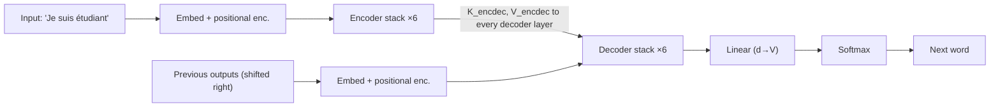
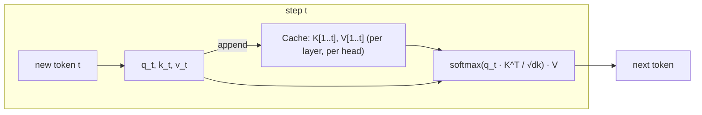
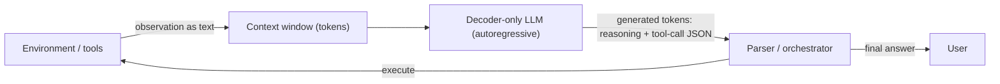

# Master Study Guide: The Transformer and GPT-2 (Decoder-Only Language Models)

**From the original encoder–decoder Transformer to GPT-2, and on to the modern LLM stack**

> **Scope.** This guide merges and extends two lectures: *The Illustrated Transformer* (Alammar, 2018) and *The Illustrated GPT-2* (Alammar, 2019). It keeps every concept, number and example from both, repairs their gaps and inaccuracies, and connects them to how today's LLMs and agents actually work.
>
> **Reading convention.** Each major topic uses the progression *Why → Intuition → Definition → Mechanism → Math → Worked example → Implementation → Trade-offs → Mistakes → Takeaways*. Labels mark the status of an idea: 🟦 **Fundamental** (will not change), 🟩 **Current practice** (what production LLMs do today), 🟥 **Research / evolving**.
>
> **Verification note.** All numerical examples (softmax values, parameter counts, attention outputs, KV-cache sizes) were recomputed in code while writing this guide. Where a lecture figure disagrees with the computation, it is flagged in §0.3.

---

## Table of Contents

0. [How to Use This Guide, Notation, and Corrections to the Lectures](#0-how-to-use-this-guide-notation-and-corrections-to-the-lectures)
1. [Language Modeling: The Task Behind Everything](#1-language-modeling-the-task-behind-everything)
2. [Representing Text: Tokens, Embeddings, Position](#2-representing-text-tokens-embeddings-position)
3. [Self-Attention from First Principles](#3-self-attention-from-first-principles)
4. [Multi-Head Attention](#4-multi-head-attention)
5. [Masked (Causal) Self-Attention and Cross-Attention](#5-masked-causal-self-attention-and-cross-attention)
6. [The Transformer Block: Residuals, Normalization, Feed-Forward](#6-the-transformer-block-residuals-normalization-feed-forward)
7. [Three Architectural Families: Encoder-Decoder, Encoder-Only, Decoder-Only](#7-three-architectural-families)
8. [The Original Transformer End to End](#8-the-original-transformer-end-to-end)
9. [GPT-2 Anatomy: Every Matrix and Every Parameter](#9-gpt-2-anatomy-every-matrix-and-every-parameter)
10. [Training: Objective, Loss, Teacher Forcing](#10-training-objective-loss-teacher-forcing)
11. [Inference: Autoregressive Generation, KV Cache, Decoding Strategies](#11-inference-autoregressive-generation-kv-cache-decoding-strategies)
12. [Beyond Language Modeling: Translation, Summarization, Transfer, Music](#12-beyond-language-modeling)
13. [What Changed Since 2018/2019 (Modern LLM Stack)](#13-what-changed-since-20182019-the-modern-llm-stack)
14. [From Language Model to Agent: Why This Architecture Matters](#14-from-language-model-to-agent)
15. [Reference Implementation (Tested NumPy + PyTorch)](#15-reference-implementation)
16. [Exam and Interview Preparation](#16-exam-and-interview-preparation)
17. [Cheat Sheets](#17-cheat-sheets)
18. [Sources and Further Reading](#18-sources-and-further-reading)

---

## 0. How to Use This Guide, Notation, and Corrections to the Lectures

### 0.1 Prerequisites you need (and where they are covered)

| Prerequisite | Needed for | Covered |
|---|---|---|
| Matrix multiplication, shapes | everything | §0.2 |
| Dot product as similarity | attention scores | §3.3 |
| Softmax | turning scores into weights/probabilities | §3.4 |
| Conditional probability, chain rule | language modeling | §1 |
| Cross-entropy, KL divergence | the loss | §10 |
| Backpropagation (conceptual) | training | §10 |
| Word embeddings (Word2vec idea) | input layer | §2.2 |

### 0.2 Notation (used consistently throughout)

| Symbol | Meaning | Typical value (original Transformer / GPT-2 small) |
|---|---|---|
| $T$ | sequence length (number of tokens) | up to 512 (lecture) / 1024 |
| $V$ | vocabulary size | ~30k–37k / 50,257 |
| $d$ or $d_{model}$ | model (residual stream) width | 512 / 768 |
| $h$ | number of attention heads | 8 / 12 |
| $d_k = d_v = d/h$ | per-head query/key and value width | 64 / 64 |
| $d_{ff}$ | feed-forward hidden width | 2048 / 3072 (= 4d) |
| $L$ | number of blocks (layers) | 6 enc + 6 dec / 12 |
| $X \in \mathbb{R}^{T\times d}$ | matrix of token vectors (one **row** per token) | |
| $W^Q,W^K \in \mathbb{R}^{d\times d_k}$, $W^V\in\mathbb{R}^{d\times d_v}$ | per-head projections | |
| $W^O \in \mathbb{R}^{(h d_v)\times d}$ | output projection | |

> **Row-vector convention.** Both lectures draw tokens as rows, so a layer computes $XW$ (not $Wx$). Every shape in this guide follows that convention.

### 0.3 Corrections and clarifications to the lectures (read this first)

These are the places where the source material is simplified, ambiguous, or wrong. Each is repeated at the relevant section.

| # | Lecture statement | Status | Correct / refined understanding | §|
|---|---|---|---|---|
| 1 | GPT-2 small has **117M** parameters; the post then finds the code has **124M** and is unsure why | ⚠️ naming error | **124M is correct.** The first release mislabeled sizes using an undercount. OpenAI's repository now lists 124M / 355M / 774M / 1.5B. Our recomputation: **124,439,808** for small. | 9.6 |
| 2 | "Encoder-Decoder **Self**-Attention" (GPT-2 post figure label) | ⚠️ misleading | It is **cross-attention**: queries come from the decoder, keys and values come from the encoder output. Nothing is "self" about it. | 5.4 |
| 3 | Positional encodings are "a pattern **the model learns**" | ⚠️ imprecise | In the original Transformer they are **fixed sinusoids** (not learned). In **GPT-2 they are learned** (the `wpe` matrix). Two different mechanisms. | 2.4 |
| 4 | The 4-d positional-encoding toy table shows `0.0001` and `0.0002` | ⚠️ toy numbers inconsistent with the formula | With $d=4$ the slow frequency is $1/100$, so position 1 gives $\sin(0.01)\approx 0.0100$ and position 2 gives $\sin(0.02)\approx 0.0200$. The pattern is right; those two entries are not. | 2.4 |
| 5 | "How do you compare two probability distributions? We **simply subtract** one from the other." | ⚠️ intuition, not the loss | The loss is **cross-entropy** (equivalently KL up to a constant). Beautifully, the *gradient* of cross-entropy w.r.t. the logits **is** $\hat p - y$, so "subtract" is the right intuition for the update, not for the loss value. | 10.3 |
| 6 | Masking "scores the future tokens as 0" | ⚠️ imprecise | Future positions are set to $-\infty$ **before** softmax so their **weight** becomes 0 after softmax. Setting the *score* to 0 would still give weight $e^0>0$. (GPT-2's TF code uses a large finite negative, $-10^{10}$, rather than a literal $-\infty$; the post says "-1 billion".) | 5.2 |
| 7 | Positional encoding "can scale to unseen lengths" | ⚠️ overstated | Sinusoids are *defined* for any position, but models trained on short contexts generalize poorly beyond them. Modern fixes: RoPE scaling, ALiBi, YaRN-style methods. | 2.4, 13 |
| 8 | Each block uses **Add & Normalize** *after* the sub-layer (post-LN) | 🟩 outdated for GPT-2+ | GPT-2 moved LayerNorm to the **input** of each sub-layer (**pre-LN**) and added a final LayerNorm. All modern LLMs are pre-LN (many use RMSNorm). | 6.3 |
| 9 | "the model multiplies that vector by the embedding matrix" (output layer) | ✅ correct but under-explained | This is **weight tying**: the output projection is $E^\top$ of the *token* embedding. It saves $V\cdot d \approx 38.6$M parameters in GPT-2 small. | 9.4 |
| 10 | "using the score as the probability of selecting that word" | ⚠️ imprecise | Scores are **logits**; probabilities require softmax (optionally with temperature). | 11.3 |
| 11 | The "keys/values are kept" cache is presented as an efficiency trick | ✅ but worth sharpening | It is **exact**, not approximate: with a causal mask, earlier tokens' keys/values at every layer provably cannot change when a new token arrives. | 11.2 |
| 12 | "Batch size 512" at training; "1024 token" context | 🟦 fine | Treat as GPT-2-era values. Modern training uses batches of millions of tokens and contexts of 10⁵–10⁶ tokens. | 13 |
| 13 | "The first layer is four times the size of the model... that's just the size the original rolled with" | ✅ | True historically; modern LLMs vary (e.g., gated FFNs use ≈ $\tfrac{8}{3}d$ with three matrices). | 6.5, 13 |
| 14 | The 4×4 masked-softmax result table (rows 0.48/0.52, 0.31/0.35/0.34, 0.25/0.26/0.23/0.26) | ⚠️ illustrative, not exact | Softmax of the printed raw scores gives 0.42/0.58, 0.24/0.38/0.37 and 0.26/0.28/0.17/0.29. The triangular structure is what the figure teaches. | 5.2 |

---

## 1. Language Modeling: The Task Behind Everything

### 1.1 Why

Almost every capability of GPT-style models, from translation to code to tool use, is obtained from **one** simple training signal: *predict the next token*. Understanding why that single task is so powerful is the key to the entire field.

### 1.2 Intuition

A phone keyboard that suggests the next word after "Thou shalt" (→ *not*, *is*, *I*) is a **language model**. GPT-2 is the same function, but:

- trained on **WebText**, ~40 GB of text scraped from the web (outbound links from Reddit posts with ≥3 karma, as described in the GPT-2 paper),
- with up to 1.5 billion parameters instead of a few megabytes (the author's SwiftKey app: 78 MB; GPT-2 small's parameters: ~500 MB in fp32 as stored; the largest variant is ~13× bigger, >6.5 GB),
- able to condition on up to 1024 previous tokens instead of two or three words.

To predict the next word well, a model must implicitly learn grammar, facts, coreference ("it" → "robot"), style and some reasoning. That is why a *simple* objective yields *general* capability.

### 1.3 Definition

A **language model** assigns a probability to a token sequence $x_1,\dots,x_T$. By the chain rule of probability (exact, no assumption):

$$P(x_1,\ldots,x_T)=\prod_{t=1}^{T}P\left(x_t\mid x_1,\ldots,x_{t-1}\right)$$

A neural LM parameterizes each factor $P_\theta(x_t\mid x_{<t})$ with a network that outputs a distribution over the vocabulary.

> **Definition: autoregressive (AR).** A model is autoregressive if it generates one token at a time and feeds each generated token back as input for the next step. GPT-2, Transformer-XL and XLNet are autoregressive in some form; **BERT is not** (§7).

### 1.4 Mechanism: the generation loop



Lecture example: prompting GPT-2 to recite the **First Law of Robotics** ("A robot may not injure a human being..."): after each token is produced it is appended to the input, and the new, longer sequence becomes the next input. The lecture notes this is the idea that made RNNs "unreasonably effective" (Karpathy, 2015); the Transformer keeps the autoregressive *loop* but replaces the recurrent *computation*.

### 1.5 Two ways to run a trained GPT-2 (lecture terminology)

| Mode | What you give it | Technical name |
|---|---|---|
| "Rambling" | only the start token (`<|endoftext|>`, written `<s>` in the lecture) | **unconditional sampling** |
| Prompted | a prefix on a topic | **conditional (interactive) sampling** |

> The lecture writes the start token as `<s>`. In real GPT-2 the same token, `<|endoftext|>` (id 50256), serves as start, end and document separator. There is no separate `<s>`.

### 1.6 Trade-offs, limitations, common mistakes

- **Mistake:** thinking a language model "retrieves" text. It computes a conditional distribution; text emerges from sampling that distribution.
- **Limitation:** a plain LM is a *text continuer*, not an assistant. Turning it into one requires instruction tuning and preference optimization (§13.6).
- **Limitation:** quadratic cost in context length (§3.7).

### 1.7 Key takeaways

1. LM = chain-rule factorization of text probability.
2. Autoregression = generate, append, repeat.
3. One cheap, self-supervised objective produces broad capability because predicting text requires modeling the world that produced it.

---

## 2. Representing Text: Tokens, Embeddings, Position

### 2.1 Why tokens are not words

The lectures use "word" and "token" interchangeably but flag this as a simplification. In reality GPT-2 uses **Byte-Pair Encoding (BPE)**, so tokens are frequently *sub-words*.

**Why sub-words?** Word-level vocabularies explode and cannot represent unseen words (out-of-vocabulary problem); character-level sequences are very long. BPE strikes a balance: start from basic units and iteratively merge the most frequent adjacent pair (Sennrich et al., 2016). GPT-2 operates on **bytes** (a byte-level BPE), so *any* string can be encoded with no unknown token. Vocabulary: **50,257** (= 256 byte tokens + 50,000 merges + 1 special `<|endoftext|>`).

*Consequences you must know:* spelling and arithmetic are hard (a word may be split arbitrarily), non-English text costs more tokens, and "context length" is measured in tokens, not words (rule of thumb for English: ~0.75 words/token).

### 2.2 Token embeddings (`wte`)

**Why:** a network needs real-valued vectors, not integer ids.

**Definition:** a learned lookup table $E_{tok}\in\mathbb{R}^{V\times d}$. Row $i$ is the vector for token $i$.

| Model | $V$ | $d$ |
|---|---|---|
| GPT-2 small | 50,257 | 768 |
| GPT-2 medium | 50,257 | 1024 |
| GPT-2 large | 50,257 | 1280 |
| GPT-2 XL | 50,257 | 1600 |
| Original Transformer (base) | ~37k shared BPE (EN–DE) | 512 |

Lookup is equivalent to multiplying a one-hot vector $e_i\in\mathbb{R}^V$ by $E_{tok}$, but implemented as indexing. The lecture's one-hot example (vocabulary `a, am, I, thanks, student, <eos>` with "am" → `[0,1,0,0,0,0]`) is exactly this one-hot index.

### 2.3 Why we need position information

Self-attention is **permutation-equivariant**: if you shuffle the input rows, the outputs shuffle identically, and nothing in the computation encodes "who is first". Compare "dog bites man" with "man bites dog": identical sets of embeddings, opposite meanings. We must inject order explicitly.

### 2.4 Positional encoding: two different solutions

The model input is **token embedding + position vector**:

$$x_t = E_{tok}[\text{id}_t] + p_t,\qquad x_t\in\mathbb{R}^d$$

(Addition, not concatenation. The lecture's figure shows `EMBEDDINGS + POSITIONAL ENCODING = EMBEDDING WITH TIME SIGNAL`.)

#### (a) Original Transformer: fixed sinusoids 🟦

$$PE_{(pos,\,2i)}=\sin\!\left(\frac{pos}{10000^{2i/d}}\right),\qquad PE_{(pos,\,2i+1)}=\cos\!\left(\frac{pos}{10000^{2i/d}}\right)$$

- $pos$ is the token position, $i\in\{0,\dots,d/2-1\}$ indexes a frequency.
- Wavelengths form a geometric progression from $2\pi$ to $10000\cdot 2\pi$: fast-varying dimensions resolve nearby positions, slow ones resolve far positions (like digits of a clock).
- **Key property:** $PE_{pos+k}$ is a *linear function* (a rotation in each sin/cos pair) of $PE_{pos}$, so relative offsets are easy for attention to learn.
- **Not learned.** The paper also tried learned embeddings and found nearly identical results.

**Interleaved vs concatenated (the lecture's "July 2020 update").** The paper interleaves sin and cos (sin at even indices, cos at odd). The Tensor2Tensor code the first version of the lecture visualized **concatenates** (all sines, then all cosines), producing a heatmap "split down the middle". Both are valid because the downstream linear layers are free to permute dimensions.

**Worked example ($d=4$, interleaved, computed):**

| pos | $\sin(pos)$ | $\cos(pos)$ | $\sin(pos/100)$ | $\cos(pos/100)$ | PE vector |
|---|---|---|---|---|---|
| 0 | 0 | 1 | 0 | 1 | [0, 1, 0, 1] |
| 1 | 0.8415 | 0.5403 | 0.0100 | 0.99995 | [0.8415, 0.5403, 0.0100, 1.0000] |
| 2 | 0.9093 | −0.4161 | 0.0200 | 0.9998 | [0.9093, −0.4161, 0.0200, 0.9998] |
| 3 | 0.1411 | −0.9900 | 0.0300 | 0.9996 | [0.1411, −0.9900, 0.0300, 0.9996] |

In the lecture's *concatenated* ordering these become `[sin, sin, cos, cos]`: pos 0 = `[0, 0, 1, 1]` ✓. pos 1 = `[0.84, 0.01, 0.54, 1]`, where the lecture prints `0.0001` (correction #4).

#### (b) GPT-2: learned absolute positions (`wpe`) 🟩

A trainable table $E_{pos}\in\mathbb{R}^{1024\times d}$; row $t$ is added to the token embedding at position $t$. Pros: simple, flexible. Cons: **hard context limit** (positions beyond 1024 have no embedding) and no built-in extrapolation.

#### (c) What modern LLMs do 🟩

**Rotary Position Embedding (RoPE)** rotates query and key vectors by position-dependent angles so that the dot product depends on *relative* offset (Su et al., 2021). The lecture's own update note names RoPE as a key evolution. See §13.2.

### 2.5 Input to the first block (GPT-2)

```
token id ──► wte[id]  (768)
                   +                =  input vector to block 1   (768)
position t ─► wpe[t]  (768)
```

Lecture text: "Sending a word to the first transformer block means looking up its embedding and adding the positional encoding vector for position #1."

### 2.6 Key takeaways

- BPE tokens ≠ words; vocab 50,257 for GPT-2.
- `wte` ($V\times d$) and `wpe` ($1024\times d$) are the model's two *global* matrices; everything else is per-layer (§9).
- Self-attention needs position information injected; the original uses fixed sinusoids, GPT-2 learns positions, modern LLMs use RoPE.

---

## 3. Self-Attention from First Principles

### 3.1 Why

Language is full of references that can only be resolved with context. Lecture examples:

- *"The animal didn't cross the street because **it** was too tired."* Does *it* mean the animal or the street? A human knows instantly; a model must **look at other positions** while encoding *it*.
- Asimov's Second Law: *"A robot must obey the orders given **it** by human beings except where **such orders** would conflict with the **First Law**."* Here **it** → *the robot*, **such orders** → *the orders given it by human beings*, **the First Law** → the entire First Law.

An RNN squeezes everything seen so far into one hidden state passed step by step: long-range information is diluted, and computation is **sequential** (position $t$ cannot be computed before $t-1$). Self-attention instead lets every position **directly read** from every other allowed position in one step, and all positions are computed **in parallel**. That parallelism is what made training on huge corpora on TPUs/GPUs practical (the lecture's headline benefit).

### 3.2 Intuition: a soft dictionary lookup

Think of a Python dictionary: you present a *query*, it is compared against *keys*, and you retrieve the matching *value*. Attention is a **soft, differentiable** version: the query is compared against **all** keys, the match strengths become weights that sum to 1, and the output is the **weighted average of all values**.

The lecture's filing-cabinet analogy, mapped precisely:

| Analogy | Attention | Role |
|---|---|---|
| Sticky note with the topic you research | **Query** $q$ | what the *current* token is looking for |
| Labels on folder tabs | **Keys** $k_j$ | what each token *advertises* about itself |
| Contents of the folders | **Values** $v_j$ | the information each token *contributes* if selected |
| "You open a blend of folders, not one" | softmax weights | soft selection |

**Why three separate projections instead of using the embedding directly?** Because *what makes a token relevant* (key), *what a token wants* (query), and *what it gives away* (value) are different functions. Learning three matrices $W^Q,W^K,W^V$ decouples them. (If $q=k=v=x$, a token would always attend mostly to itself, since $x\cdot x$ is the largest dot product.)

### 3.3 Definition and mechanism (vector view, one token)

For the token at position $i$ with input vector $x_i\in\mathbb{R}^d$:

1. **Project:** $q_i=x_iW^Q,\;k_j=x_jW^K,\;v_j=x_jW^V$ for all $j$.
2. **Score:** $s_{ij}=q_i\cdot k_j$ (dot product = similarity).
3. **Scale:** $s_{ij}/\sqrt{d_k}$.
4. **Normalize:** $\alpha_{ij}=\mathrm{softmax}_j(s_{ij}/\sqrt{d_k})$, so $\alpha_{ij}\ge 0$ and $\sum_j\alpha_{ij}=1$.
5. **Mix:** $z_i=\sum_j\alpha_{ij}v_j$.

The lecture splits this into six numbered steps; they are the five above with "multiply each value by its softmax score" and "sum" listed separately.

### 3.4 The lecture's numeric example ("Thinking Machines")

| Quantity | "Thinking" ($i=1$) vs itself | vs "Machines" |
|---|---|---|
| Score $q_1\cdot k_j$ | 112 | 96 |
| ÷ $\sqrt{d_k}=\sqrt{64}=8$ | 14 | 12 |
| softmax | **0.8808** | **0.1192** |

(Lecture rounds to 0.88 / 0.12; verified.) Output: $z_1=0.88\,v_1+0.12\,v_2$.

**Softmax, explicitly:** $\mathrm{softmax}(s)_j=\dfrac{e^{s_j}}{\sum_m e^{s_m}}$. Check: $e^{14}/(e^{14}+e^{12})=1/(1+e^{-2})=0.8808$ ✓. Only **differences** between scores matter (softmax is shift-invariant), which is why implementations subtract the row max for numerical stability.

### 3.5 Why divide by $\sqrt{d_k}$ (derivation)

**Claim:** if $q,k$ have independent components with mean 0 and variance 1, then $q\cdot k=\sum_{m=1}^{d_k}q_mk_m$ has mean 0 and variance $d_k$.

*Proof.* Each term $q_mk_m$ has mean $0$ and variance $E[q_m^2]E[k_m^2]=1$; the $d_k$ terms are independent, so variances add → $d_k$. ∎

So raw scores have standard deviation $\sqrt{d_k}$. Large-magnitude inputs push softmax into its **saturated regime** where one weight ≈ 1 and the rest ≈ 0, and the **gradient** of softmax there is ≈ 0 (the Jacobian $\mathrm{diag}(p)-pp^\top\to 0$). Dividing by $\sqrt{d_k}$ restores unit variance. Empirical check (20,000 random draws):

| $d_k$ | Var of $q\cdot k$ | Var of $q\cdot k/\sqrt{d_k}$ |
|---|---|---|
| 4 | 4.00 | 1.00 |
| 64 | 64.5 | 1.01 |
| 512 | 508 | 0.99 |

The lecture's own numbers illustrate the stakes: **without** scaling, $\mathrm{softmax}([112,96])$ puts weight $\approx 1-10^{-7}$ on the first token (completely saturated); with scaling you get a usable 0.88 / 0.12.

> **Common mistake:** saying the scaling is "for numerical stability of the exponent". The real reason is **gradient flow / softmax temperature**; stability is handled separately by max-subtraction.

### 3.6 Matrix form (what is actually executed)

Stack tokens as rows: $X\in\mathbb{R}^{T\times d}$.

$$Q=XW^Q,\quad K=XW^K,\quad V=XW^V\qquad (T\times d_k,\;T\times d_k,\;T\times d_v)$$

$$\boxed{Z=\mathrm{softmax}\!\left(\frac{QK^\top}{\sqrt{d_k}}\right)V}\qquad Z\in\mathbb{R}^{T\times d_v}$$

**Shape walk-through:**

| Step | Operation | Shape |
|---|---|---|
| 1 | $QK^\top$ | $(T\times d_k)(d_k\times T)=T\times T$ (the **attention-score matrix**; row $i$ = scores of query $i$ against all keys) |
| 2 | ÷ $\sqrt{d_k}$, (mask), row-wise softmax | $T\times T$, each row sums to 1 |
| 3 | × $V$ | $(T\times T)(T\times d_v)=T\times d_v$ |

**Why the lecture's dimension choice (512 → 64)?** With $h=8$ heads and $d_k=d/h=64$, running all heads costs about the same as one head of width 512. "They don't *have* to be smaller; this is an architecture choice to make multi-head computation (mostly) constant."

### 3.7 Worked example (fully computed, 3 tokens, $d=4$, $d_k=2$)

Inputs (rows) and weights chosen for readability:

$$X=\begin{bmatrix}1&0&1&0\\0&1&0&1\\1&1&0&0\end{bmatrix},\;
W^Q=W^K=\begin{bmatrix}1&0\\0&1\\1&0\\0&1\end{bmatrix},\;
W^V=\begin{bmatrix}1&0\\0&2\\1&1\\0&1\end{bmatrix}$$

$$Q=K=\begin{bmatrix}2&0\\0&2\\1&1\end{bmatrix},\qquad V=\begin{bmatrix}2&1\\0&3\\1&2\end{bmatrix}$$

**Scores** $QK^\top$ and scaled by $1/\sqrt2$:

$$QK^\top=\begin{bmatrix}4&0&2\\0&4&2\\2&2&2\end{bmatrix}\;\longrightarrow\;\frac{QK^\top}{\sqrt2}=\begin{bmatrix}2.828&0&1.414\\0&2.828&1.414\\1.414&1.414&1.414\end{bmatrix}$$

**Unmasked attention weights** $A$ (row softmax) and output $Z=AV$:

$$A=\begin{bmatrix}0.768&0.045&0.187\\0.045&0.768&0.187\\0.333&0.333&0.333\end{bmatrix},\qquad Z=\begin{bmatrix}1.723&1.277\\0.277&2.723\\1.000&2.000\end{bmatrix}$$

*Reading it:* token 1 attends 77% to itself, 19% to token 3, 4.5% to token 2. Token 3's query $[1,1]$ is equally similar to every key, so it averages all values (uniform 1/3 each) → $[1,2]$.

**Causal (masked) version.** Set the strictly upper triangle to $-\infty$ before softmax:

$$A_{causal}=\begin{bmatrix}1&0&0\\0.056&0.944&0\\0.333&0.333&0.333\end{bmatrix},\qquad Z_{causal}=\begin{bmatrix}2.000&1.000\\0.112&2.888\\1.000&2.000\end{bmatrix}$$

Observe: token 1 can only see itself, so $z_1=v_1=[2,1]$ exactly. Token 3 is last and sees everyone, so its row is unchanged. **The last position never loses information from masking; the first loses the most.**

### 3.8 Complexity and trade-offs 🟦

| Aspect | Self-attention | RNN |
|---|---|---|
| Sequential steps per layer | $O(1)$ | $O(T)$ |
| Max path length between any two tokens | $O(1)$ | $O(T)$ |
| Compute per layer | $O(T^2\,d)$ | $O(T\,d^2)$ |
| Memory for scores (naive) | $O(h\,T^2)$ | $O(d)$ state |

Quadratic cost in $T$ is the central limitation: doubling context quadruples attention compute. Mitigations (§13): FlashAttention (exact, IO-aware, avoids materializing $T\times T$), sparse/sliding-window attention, grouped-query attention for the KV cache, and linear-attention/state-space alternatives (research-level).

### 3.9 Common mistakes

- Treating attention weights as a faithful *explanation* of the model's decision. They show where information flows in one head of one layer, not why the output is what it is.
- Confusing the **score matrix** ($T\times T$, from $Q$ and $K$) with the **output** ($T\times d_v$, uses $V$).
- Forgetting softmax is **row-wise** (over keys $j$, for each query $i$).

### 3.10 Key takeaways

1. Attention = softmax-normalized similarity between queries and keys, used to average values.
2. $\sqrt{d_k}$ keeps score variance at 1 so softmax gradients survive.
3. All positions are computed in parallel via $QK^\top$; cost is $O(T^2d)$.

---

## 4. Multi-Head Attention

### 4.1 Why (the lecture's two reasons, sharpened)

1. **Different positions at once.** A single attention head produces *one* weighted average. For *it*, one head might need *animal* (reference) while another needs *tired* (attribute). One softmax must compromise; several heads need not. The lecture's visualization at layer 5 shows exactly this: one head concentrates on "The animal", another on "tired".
2. **Multiple representation subspaces.** Each head has its own $W^Q_h,W^K_h,W^V_h$, so it projects into a different low-dimensional subspace and can measure a different notion of similarity (syntax, coreference, position, delimiters...). Heads are **randomly initialized differently** so they can specialize (identical init would give identical heads forever, since gradients would match).

### 4.2 Mechanism

For head $r=1..h$:

$$\mathrm{head}_r=\mathrm{softmax}\!\left(\frac{(XW^Q_r)(XW^K_r)^\top}{\sqrt{d_k}}\right)(XW^V_r)\in\mathbb{R}^{T\times d_v}$$

Concatenate along the feature axis and mix with an output projection:

$$\mathrm{MHA}(X)=\mathrm{Concat}(\mathrm{head}_1,\dots,\mathrm{head}_h)\,W^O$$

**Why $W^O$?** The next sub-layer expects a single $T\times d$ matrix, not $h$ separate ones. Concatenation yields a "Frankenstein's monster" (GPT-2 post) of independent head outputs; $W^O$ (learned jointly) lets the model decide **how to combine** them into a homogeneous residual-stream update.

### 4.3 Shapes

| Model | $d$ | $h$ | $d_k=d_v$ | Concat width | $W^O$ |
|---|---|---|---|---|---|
| Original Transformer | 512 | 8 | 64 | 8·64 = 512 | 512×512 |
| GPT-2 small | 768 | 12 | 64 | 12·64 = 768 | 768×768 |
| GPT-2 XL | 1600 | 25 | 64 | 25·64 = 1600 | 1600×1600 |

> GPT-2 XL's 25 heads is from the released config; the lecture does not list head counts beyond small.

### 4.4 GPT-2's efficient implementation (the lecture's "1, 1.5, 2, 3, 3.5, 4" steps)

Instead of $h$ separate small matrices, GPT-2 does **one fused matmul** and reshapes:

| Step (lecture name) | Operation | Shape (small, one token) |
|---|---|---|
| 1 Create q,k,v | input × `attn/c_attn/w` (+bias) | $(768)\times(768\times2304)\to(2304)$ |
| (split) | split into three | $q,k,v\in\mathbb{R}^{768}$ |
| 1.5 Split heads | reshape each | $768\to 12\times 64$ |
| 2 Score | each head: $q_{\cdot,r}\cdot k_{j,r}$ for all cached $j$, scale, mask, softmax | per head: weights over $j\le t$ |
| 3 Sum | weights × $v_{j,r}$ | per head: 64 |
| 3.5 Merge heads | concatenate 12×64 | 768 |
| 4 Project | × `attn/c_proj/w` (+bias) | $(768)\times(768\times768)\to(768)$ |

Splitting heads is "simply reshaping the long vector into a matrix": no extra parameters. Fusing $W^Q,W^K,W^V$ into one $d\times 3d$ matrix is just a speed optimization (one large matmul is more efficient than three).

### 4.5 Parameter count of one attention sub-layer

$$\underbrace{d\cdot 3d + 3d}_{c\_attn}+\underbrace{d\cdot d+d}_{c\_proj}\;\overset{d=768}{=}\;1{,}771{,}776+590{,}592=2{,}362{,}368$$

≈ $4d^2$ weights: Q, K, V and O are each $d\times d$ in total across heads.

### 4.6 Trade-offs and modern variants 🟩

| Variant | Idea | Why |
|---|---|---|
| **MHA** (this guide) | $h$ separate K,V per head | max expressiveness |
| **MQA** (Shazeer, 2019) | one shared K,V for all heads | tiny KV cache, faster decoding; some quality loss |
| **GQA** (Ainslie et al., 2023) | groups of heads share K,V | near-MHA quality with near-MQA cache; used in most modern open LLMs |

The lecture's 2025 update explicitly cites Multi-Query Attention and RoPE as developments since the original post. The motivation is **inference memory bandwidth**, not training (§11.2).

### 4.7 Common mistakes

- Thinking more heads = more parameters. At fixed $d$, $h$ only changes how $d$ is partitioned: parameter count is constant ($4d^2$).
- Believing each head has a clean human-interpretable role. Some do (induction heads, previous-token heads); many do not, and the lecture's "all eight heads" figure is deliberately shown to be hard to read.

### 4.8 Key takeaways

1. $h$ parallel attention computations in $d/h$-dimensional subspaces, concatenated, then mixed by $W^O$.
2. Cost and parameters are essentially independent of $h$.
3. Modern variants (MQA/GQA) shrink the KV cache by sharing K,V across heads.

---

## 5. Masked (Causal) Self-Attention and Cross-Attention

### 5.1 Why masking is needed

A language model is trained to predict $x_{t}$ from $x_{<t}$. If position $t$ could attend to positions $>t$ it could **copy the answer**: training loss would collapse to ~0 and the model would learn nothing useful, then fail at generation where the future doesn't exist. So position $i$ must only attend to $j\le i$.

> **BERT contrast.** BERT hides tokens by *replacing them with `[MASK]`* in the input and lets attention see everything else. GPT *keeps the tokens* but **blocks the attention edges** to the right. Same word "masking", different mechanism (lecture: "not by changing the word to [mask] like BERT, but by interfering in the self-attention calculation").

### 5.2 Mechanism

Add a mask $M$ with $M_{ij}=0$ for $j\le i$ and $-\infty$ for $j>i$ to the scaled scores:

$$\mathrm{CausalAttn}(Q,K,V)=\mathrm{softmax}\!\left(\frac{QK^\top}{\sqrt{d_k}}+M\right)V$$

Because $e^{-\infty}=0$, masked positions get **exactly zero weight** and the remaining weights renormalize among the visible tokens. (Setting the *score* to 0 instead, as the lecture's prose says, would *not* do this: $e^0=1$ still contributes. The lecture's figures show the correct $-\infty$.) In OpenAI's TF code a large finite constant replaces $-\infty$ to avoid NaNs in fp16; the lecture quotes "−1 billion".

**Lecture's 4×4 mask pipeline** (robot / must / obey / orders):

1. Scores $QK^\top$ (all pairs).
2. Apply the triangular mask → upper triangle $=-\infty$.
3. Row-wise softmax → each row sums to 1; the upper triangle is 0.

> ⚠️ **Numerical correction.** The lecture's raw-score matrix has second row $[0.19,\,0.50]$ visible. $\mathrm{softmax}([0.19,0.50])=[0.4231,\,0.5769]$, but the lecture's final table prints $[0.48,\,0.52]$; likewise row 3 should be $[0.2445,0.3834,0.3721]$ (lecture: 0.31/0.35/0.34) and row 4 $[0.2634,0.2769,0.1714,0.2882]$ (lecture: 0.25/0.26/0.23/0.26). The tables are **illustrative of the lower-triangular shape**, not exact softmax outputs of the printed scores. The structure (row 1 = [1,0,0,0], rows sum to 1, zeros above the diagonal) is what matters. (Similarly, the 0.1%…18% attention percentages in the "it" figure sum to ≈ 99.1% because of rounding.)

### 5.3 Training with one mask = many examples at once

The lecture's "features and labels" table is the key insight:

| Example | Visible input | Label (target) |
|---|---|---|
| 1 | robot | must |
| 2 | robot must | obey |
| 3 | robot must obey | orders |
| 4 | robot must obey orders | `<eos>` |

One forward pass over the 4-token sequence with a causal mask computes **all four predictions in parallel**, because row $i$ of the attention only sees tokens $\le i$. This is why a decoder-only Transformer trains with $T$ supervised examples per sequence at the price of one pass (**teacher forcing**, §10). At *inference* the future tokens do not exist yet, so generation is sequential (§11).

### 5.4 Cross-attention (encoder–decoder attention)

*Naming correction:* the GPT-2 post's figure labels this "Encoder-Decoder Self-Attention". The original paper calls it **encoder–decoder attention**; it is **cross-attention**.

- **Queries** $Q$ come from the **decoder** (the layer below).
- **Keys and values** $K,V$ come from the **top encoder's output** (the same encoder output is used by *every* decoder layer).

| Tensor | Shape | Source |
|---|---|---|
| $Q$ | $T_{dec}\times d_k$ | decoder |
| $K,V$ | $T_{enc}\times d_k$ / $T_{enc}\times d_v$ | encoder output |
| scores / weights | $T_{dec}\times T_{enc}$ | each target position attends over all source positions |
| output | $T_{dec}\times d_v$ | |

**Intuition:** while generating the English word "student", the decoder asks "which source words matter now?" and the answer is "étudiant". This is the same idea as attention in seq2seq RNN translation, which the lecture builds on. **No mask** is applied here: the whole source sentence is known.

### 5.5 Three kinds of attention, side by side

| Type | Q from | K,V from | Mask | Used in |
|---|---|---|---|---|
| Encoder self-attention | encoder layer below | same | none (bidirectional) | encoder, BERT |
| Masked (causal) self-attention | decoder layer below | same | causal | decoder, GPT |
| Cross-attention | decoder | encoder output | none | encoder–decoder only |

### 5.6 Key takeaways

1. Causal masking sets future scores to $-\infty$ pre-softmax; that enforces autoregression and makes training parallel.
2. Causality ⇒ row $i$ of every layer depends only on tokens $\le i$ (basis of the KV cache).
3. Cross-attention is the only place the encoder talks to the decoder; decoder-only models drop it.

---

## 6. The Transformer Block: Residuals, Normalization, Feed-Forward

### 6.1 Why a block has more than attention

Attention is a *mixing across positions* operation; it is (apart from the softmax) linear in the values. The network also needs (a) **per-token nonlinear computation** and (b) a way to train **deep stacks** (6–96+ layers) stably. The block supplies both with a feed-forward network, residual connections, and layer normalization.

### 6.2 The block as a pipeline

Encoder block (original):



Lecture: *each sub-layer (self-attention, FFN) has a residual connection around it and is followed by layer normalization*, i.e. $\mathrm{LayerNorm}(X+\mathrm{Sublayer}(X))$. This is **post-LN**.

### 6.3 Residual connections and layer normalization

**Residual connection** ($y=x+F(x)$). *Why:* gradients flow through the identity path unchanged, so deep stacks train; each layer learns an **update** to a running representation instead of a whole new one. Modern view: the **residual stream** is a shared communication channel; attention and MLP layers *read from* and *write to* it additively.

**Layer normalization** (Ba et al., 2016) normalizes each token vector across its $d$ features:

$$\mathrm{LN}(x)=\gamma\odot\frac{x-\mu}{\sqrt{\sigma^2+\epsilon}}+\beta,\quad \mu=\tfrac1d\sum_i x_i,\;\sigma^2=\tfrac1d\sum_i(x_i-\mu)^2$$

($\gamma,\beta\in\mathbb{R}^d$ learned, so $2d$ parameters per LN.) Unlike BatchNorm it does not depend on the batch or sequence, which is essential for variable-length text and for one-token-at-a-time generation.

**Post-LN vs Pre-LN 🟩 (a correction to the lectures' diagrams):**

| | Post-LN (original, lecture figure) | Pre-LN (GPT-2 onward) |
|---|---|---|
| Formula | $x\leftarrow\mathrm{LN}(x+F(x))$ | $x\leftarrow x+F(\mathrm{LN}(x))$ |
| Identity path | passes through LN each layer | **clean** identity path |
| Training | needs learning-rate warm-up; can diverge when deep | stable, easier to scale |
| Extra | | final LN after the last block |

GPT-2 moved LN to the **input of each sub-block** and added an additional LN after the final block (stated in the GPT-2 paper). The GPT-2 lecture notes only that "transformers use a lot of layer normalization" and omits it from its drawings. Modern LLMs are pre-LN, and most replace LN with **RMSNorm** (no mean subtraction, no bias; Zhang & Sennrich, 2019).

### 6.4 GPT-2 block (pre-LN, decoder-only)

$$h = x + \mathrm{CausalMHA}(\mathrm{LN}_1(x)),\qquad y = h+\mathrm{MLP}(\mathrm{LN}_2(h))$$

```
x ──┬──────────────────────────┐
    └─ LN1 ─ Masked MHA ───────┴─► (+) = h
h ──┬──────────────────────────┐
    └─ LN2 ─ MLP (d→4d→d) ─────┴─► (+) = y   → next block
```

Compare with the original *decoder* block (three sub-layers): masked self-attention → **cross-attention** → FFN. A decoder-only block simply **deletes cross-attention** (there is no encoder to attend to). That is the entire architectural difference the GPT-2 lecture's "decoder-only block" section describes ("they did away with that second self-attention layer").

### 6.5 The position-wise feed-forward network (FFN / MLP)

**Why:** after attention gathers context, each token needs nonlinear processing to turn mixed information into new features. Empirically the MLP stores much of the model's factual knowledge (research-level interpretation: key–value memories, Geva et al., 2021).

**Definition:** the *same* two-layer network is applied **independently to every position** (lecture: "the exact same feed-forward network is independently applied to each position"):

$$\mathrm{FFN}(x)=\phi(xW_1+b_1)W_2+b_2,\quad W_1\in\mathbb{R}^{d\times d_{ff}},\;W_2\in\mathbb{R}^{d_{ff}\times d}$$

- Original: $\phi=\mathrm{ReLU}$, $d=512$, $d_{ff}=2048$.
- GPT-2: $\phi=\mathrm{GELU}$ (smooth ReLU), $d_{ff}=4d=3072$ for small.
- **Why 4×?** The lecture's honest answer: "that's just the size the original transformer rolled with." It gives enough capacity to be useful and has stood up empirically.

**Key property for parallelism (lecture):** attention has dependencies *between* positions, but the FFN does not, so the FFN for all positions runs fully in parallel.

**Shapes (GPT-2 small, one token):** $768\to3072\to768$. Parameters: $768\cdot3072+3072=2{,}362{,}368$ and $3072\cdot768+768=2{,}360{,}064$. Together ≈ $8d^2$: **two-thirds of every block's parameters live in the MLP.**

**Modern variants 🟩:** gated FFNs such as **SwiGLU** (Shazeer, 2020) use three matrices with $d_{ff}\approx\tfrac83 d$ to keep parameter count equal; used in Llama-family and many others.

### 6.6 Key takeaways

1. Block = attention (mix across tokens) + MLP (transform each token), each wrapped in a residual connection with normalization.
2. GPT-2 is **pre-LN** with GELU and a 4× MLP; the lecture's post-LN figures describe the original Transformer.
3. Params per block ≈ $12d^2$: $4d^2$ attention + $8d^2$ MLP.

---

## 7. Three Architectural Families

### 7.1 Why this matters

The original Transformer solved **translation**, a sequence-to-sequence task, so it had an encoder and a decoder. Subsequent work asked: *for other tasks, do we need both?* Dropping one half gave the two most influential model families. As the lecture says, a lot of later work "shed either the encoder or decoder... stacking blocks as high as practically possible, feeding massive amounts of text, throwing vast amounts of compute".

### 7.2 Comparison

| | **Encoder-decoder** | **Encoder-only** | **Decoder-only** |
|---|---|---|---|
| Example | Original Transformer, T5, BART | **BERT** | **GPT-2**, GPT-3/4, Llama, Claude |
| Blocks | encoder stack + decoder stack | encoder blocks only | decoder blocks only (no cross-attention) |
| Attention | bi-directional (enc), causal + cross (dec) | **bi-directional** | **causal** |
| Autoregressive? | decoder: yes | **no** | **yes** |
| Output | a new sequence | contextual vectors for each token | next-token distribution |
| Training signal | seq2seq (e.g., translation) | masked-token prediction (MLM) | next-token prediction |
| Natural strengths | translation, summarization | classification, tagging, retrieval embeddings | open-ended generation, in-context learning |

Lecture's framing: *"In losing auto-regression, BERT gained the ability to incorporate the context on both sides of a word... XLNet brings back autoregression while finding an alternative way to incorporate the context on both sides."* **Transformer-XL** adds recurrence across segments (stack of "recurrent decoder blocks" in the lecture figure).

### 7.3 Why decoder-only won for LLMs 🟩

(Research-level synthesis, not stated in the lecture.)

- One uniform objective (next-token) needs **no labels** and scales to the whole web.
- **Every token** is a training example ($T$ predictions per sequence), which is very data-efficient.
- Generation, translation, QA, and instruction following all become "continue this text", so one model + a **prompt** covers many tasks (GPT-2's zero-shot results; GPT-3's in-context learning).
- Inference is simpler and a KV cache makes it efficient.

*Caveat:* bidirectional encoders are still the better choice for many embedding/classification workloads, and encoder-decoder models remain strong for fixed input→output tasks.

### 7.4 Evolution of the block (the lecture's chronology)

| Step | Model | Block | Context |
|---|---|---|---|
| 1 | Original Transformer (2017) | encoder block; decoder block with cross-attention | 512 |
| 2 | *Generating Wikipedia by Summarizing Long Sequences* (Liu et al., 2018) | **decoder-only** ("Transformer-Decoder"), 6 blocks, encoder discarded | **~4000** tokens |
| 3 | Character-level LM with deeper self-attention (Al-Rfou et al., 2018) | decoder-only at char level | |
| 4 | **GPT-2 (2019)** | decoder-only, 12–48 blocks | 1024 |

---

## 8. The Original Transformer End to End

This section assembles §2–§6 into the full encoder–decoder model from the first lecture.

### 8.1 High-level data flow



- Encoder: six identical blocks, **not weight-shared**; the paper says "nothing magical about six".
- Decoder: six identical blocks. Each has masked self-attention → cross-attention → FFN.
- Embedding happens only at the bottom; every higher block receives the vectors from the block below (size $d=512$).
- The list length (max sequence) is a hyperparameter, "basically the length of the longest sentence in the training set".

### 8.2 Parallelism: why this beat RNNs

Each token flows along its **own path** through the encoder. Dependencies between paths exist only inside self-attention; the FFN is independent per position. Therefore, within a layer, all $T$ positions are computed at once: ideal for TPUs/GPUs. (Lecture: Google Cloud recommended the Transformer as the reference model for Cloud TPU.)

### 8.3 The decoder step by step (lecture "Decoding time step 1…6")

1. The encoder processes the whole source once; its top output becomes $K_{encdec},V_{encdec}$.
2. The decoder starts from a start symbol. At each time step it embeds the **previous outputs**, adds positions, runs through its blocks, and emits one word.
3. The new word is fed back for the next step; repeat until an end-of-sentence symbol.

Difference between encoder and decoder self-attention (lecture): *the decoder's self-attention may only attend to earlier output positions, by masking future positions to $-\infty$ before softmax.* Cross-attention builds **Q from the layer below** and takes **K,V from the encoder stack**.

### 8.4 Final linear + softmax

The top decoder emits one $d$-vector per position. A linear layer $W\in\mathbb{R}^{d\times V}$ maps it to a **logits** vector of size $V$; softmax turns logits into probabilities.

Lecture example: vocabulary of 10,000 → logits 10,000 wide; the cell with the highest probability (`argmax`, index 5 → "am") is the output word.

**Weight tying:** many Transformers share this matrix with the input embedding ($W=E^\top$; Press & Wolf, 2017). The original paper does so; GPT-2 does as well (§9.4).

### 8.5 Training in the lecture's toy example

Vocabulary: `a, am, I, thanks, student, <eos>` (indices 0–5). Target for "je suis étudiant" is "I am a student `<eos>`", five one-hot targets (the lecture tables). A trained model's output distribution at each position puts ~0.8–0.99 on the right word and a *little* mass elsewhere ("a very useful property of softmax which helps training"). Details of the loss are in §10.

---

## 9. GPT-2 Anatomy: Every Matrix and Every Parameter

### 9.1 Model family (lecture table, with corrected parameter counts)

| | Small | Medium | Large | XL |
|---|---|---|---|---|
| Blocks $L$ | 12 | 24 | 36 | 48 |
| Width $d$ | 768 | 1024 | 1280 | 1600 |
| Heads $h$ | 12 | 16 | 20 | 25 |
| Context | 1024 | 1024 | 1024 | 1024 |
| Vocab | 50,257 | 50,257 | 50,257 | 50,257 |
| Lecture's label | 117M | 345M | 762M | 1,542M |
| **Recomputed (this guide)** | **124.4M** | **354.8M** | **774.0M** | **1,557.6M** |
| Official name today | 124M | 355M | 774M | 1.5B |

(The lecture's labels were the original release names; the recomputation, below, matches the released checkpoints. Head counts 16/20/25 are from the released configs, not the lecture.)

### 9.2 The forward pass for one token (fully traced)

Setting: GPT-2 small, processing token at position $t$.

```
id → wte[id] (768) + wpe[t] (768) = x0
for block ℓ = 1..12:
    a   = LN1(x)                           768
    qkv = a · c_attn.w + c_attn.b          768 → 2304  → split q,k,v (768 each)
    reshape heads: 12 × 64
    per head: scores = q·K_cacheᵀ / 8, causal mask, softmax, · V_cache   → 64
    concat 12 heads → 768; · c_proj.w + b                         768
    x = x + that                           (residual)
    m   = LN2(x)
    m   = GELU(m · fc.w + fc.b)            768 → 3072
    m   = m · proj.w + proj.b              3072 → 768
    x = x + m                              (residual)
x = LN_final(x)
logits = x · wteᵀ                          768 → 50257   (weight tying)
```

The lecture draws the same path in its "journey up the stack" figure (`Decoder #1 … #12, Position #1 output vector`), but hides LN and residuals.

### 9.3 Per-block parameter table (GPT-2 small)

| Sub-layer | Matrix (lecture name) | Shape | Params (weights + bias) |
|---|---|---|---|
| LN1 | gain, bias | 768 + 768 | 1,536 |
| Attention QKV | `attn/c_attn/w` | 768×2304 | 1,771,776 |
| Attention out | `attn/c_proj/w` | 768×768 | 590,592 |
| LN2 | gain, bias | 768 + 768 | 1,536 |
| MLP up | `mlp/c_fc/w` | 768×3072 | 2,362,368 |
| MLP down | `mlp/c_proj/w` | 3072×768 | 2,360,064 |
| **Block total** | | | **7,087,872** |

### 9.4 Global parameters and the total

| Component | Shape | Params |
|---|---|---|
| Token embeddings `wte` (also output head) | 50,257×768 | 38,597,376 |
| Positional embeddings `wpe` | 1024×768 | 786,432 |
| 12 blocks × 7,087,872 | | 85,054,464 |
| Final LayerNorm | 2×768 | 1,536 |
| **Total** | | **124,439,808** |

**Why the lecture's "117M vs 124M" confusion:** the author counted correctly (≈124M) from the published code and noticed the mismatch with the announced 117M. The *announced* sizes were wrong. Quick sanity formula: $\approx 12Ld^2+Vd+1024d$ with $12\cdot12\cdot768^2=84.9$M, plus embeddings 39.4M ≈ 124.3M ✓.

**Weight tying detail:** the output layer reuses `wte`. Without tying, the head would add another $V d=38.6$M parameters (→ ~163M). This also gives a neat interpretation: logits are dot products between the final hidden vector and each token's embedding, so the model emits tokens whose embeddings align with its final state. This is what the lecture describes as "multiply that vector by the embedding matrix; the result is interpreted as a score for each word".

**Fraction of parameters:** attention 2.36M and MLP 4.72M of 7.09M per block, i.e. 33% / 67%.

### 9.5 What is global vs per-layer (lecture's recap)

"Each block has its own set of these weights. On the other hand, the model has only one token-embedding matrix and one positional-encoding matrix." Weights are **not shared** across layers (contrast with ALBERT/Universal Transformers).

### 9.6 Common mistakes

- Counting a separate output matrix (it is tied).
- Forgetting biases or the final LayerNorm when matching parameter counts exactly.
- Assuming GPT-2 uses sinusoids (it learns `wpe`).
- Thinking later tokens can change earlier tokens' representations: they cannot (causality).

### 9.7 Key takeaways

1. GPT-2 small = 12 pre-LN decoder blocks, $d=768$, 12 heads, MLP 3072, tied 50,257-token embedding, learned positions, context 1024.
2. 124,439,808 parameters; ≈ $12d^2$ per block.
3. Everything per token is a stack of $768$-vectors; attention is the only cross-token operation.

---

## 10. Training: Objective, Loss, Teacher Forcing

### 10.1 Why

Training must turn text into a differentiable signal. The "labels" are free: **the text itself shifted by one position**. This self-supervision is what allowed GPT-2 to train on 40 GB of unlabeled web text.

### 10.2 Setup

Given a token sequence $x_1,\dots,x_T$:

- **Input:** $x_1,\dots,x_{T-1}$ (positions 1…T−1)
- **Target:** $x_2,\dots,x_T$ (the same sequence shifted left)
- Model outputs logits $z_t\in\mathbb{R}^V$ at every position; $\hat p_t=\mathrm{softmax}(z_t)$.

This is exactly the lecture's "features and labels" table (§5.3): `robot → must`, `robot must → obey`, … `robot must obey orders → <eos>`.

**Teacher forcing:** at training time the model is fed the **true** previous tokens, never its own predictions. Combined with the causal mask, all $T$ positions are trained in **one parallel forward pass**. *Trade-off:* **exposure bias**: at inference the model conditions on its own (possibly imperfect) outputs, a distribution it never saw during training. In practice this is manageable for large models but is one reason sampled text can drift.

> The lectures' remark that training uses *longer sequences, many tokens at once and larger batches (512)* vs inference's one token at a time is this parallelism.

### 10.3 The loss: cross-entropy

**Definition.** For a single position with one-hot target $y$ (true token index $c$) and predicted distribution $\hat p$:

$$\mathcal{L}=-\sum_{i=1}^{V}y_i\log\hat p_i=-\log\hat p_c$$

Averaged over all positions and sequences in the batch, this is the **negative log-likelihood** of the data: minimizing it is **maximum-likelihood estimation** of the chain-rule factorization in §1.3. It equals $\mathrm{KL}(y\,\|\,\hat p)$ because the entropy of a one-hot target is 0 (the lecture points to cross-entropy and KL for this reason).

**Derivation of the gradient w.r.t. logits** (the elegant result):

$$\log\hat p_c=z_c-\log\sum_m e^{z_m}\;\Rightarrow\;\frac{\partial\mathcal{L}}{\partial z_i}=\hat p_i-\mathbb{1}[i=c]=\hat p_i-y_i$$

So the gradient is literally **"prediction minus target"**. This is the correct sense of the lecture's loose statement that you "simply subtract one distribution from the other": it describes the *error signal* backpropagated through the network, while the *loss value* is $-\log\hat p_c$ (correction #5).

### 10.4 Worked examples (from the lecture's toy vocabulary)

Vocabulary: `a, am, I, thanks, student, <eos>`.

**(a) Untrained model, target "thanks".** $\hat p=[0.2,0.2,0.1,0.2,0.2,0.1]$, $y=[0,0,0,1,0,0]$.

- Loss $=-\ln0.2=1.609$ (compare uniform guessing $\ln6=1.792$).
- Gradient on logits $=\hat p-y=[0.2,\,0.2,\,0.1,\,-0.8,\,0.2,\,0.1]$: push the logit of "thanks" **up**, all others **down**.

**(b) Trained model, sentence "I am a student `<eos>`".** The lecture's trained table gives probabilities of the correct word at the five positions: 0.93, 0.80, 0.99, 0.94, 0.98.

| Position | Correct word | $\hat p$ | $-\ln\hat p$ |
|---|---|---|---|
| 1 | I | 0.93 | 0.0726 |
| 2 | am | 0.80 | 0.2231 |
| 3 | a | 0.99 | 0.0101 |
| 4 | student | 0.94 | 0.0619 |
| 5 | `<eos>` | 0.98 | 0.0202 |
| **Mean loss** | | | **0.0776** |

**Perplexity** $=e^{\mathcal{L}}=e^{0.0776}=1.081$: "the model is about as uncertain as choosing among 1.08 equally likely words". A model guessing uniformly over GPT-2's vocabulary has loss $\ln 50257=10.83$ and perplexity 50,257.

**Why every position gets a bit of probability:** softmax never outputs exact zeros, which keeps the log finite and the gradient informative (the lecture's closing remark on the trained table).

### 10.5 Optimization in practice 🟩

(Not covered in the lectures; needed to understand real training.)

- **Optimizer:** AdamW (Adam with decoupled weight decay).
- **Schedule:** linear warm-up then cosine/linear decay; warm-up is critical for post-LN and still used with pre-LN.
- **Precision:** mixed precision (bf16/fp16 compute, fp32 master weights).
- **Gradient clipping** (norm 1.0), dropout (GPT-2 used 0.1; many modern LLMs use none because data is not repeated).
- **Scale:** loss falls as a smooth power law in parameters, data and compute (Kaplan et al., 2020); compute-optimal training balances parameters and tokens (Hoffmann et al., 2022 "Chinchilla", ≈20 tokens per parameter) 🟥 (practice has since moved toward training smaller models on far more tokens for cheaper inference).

### 10.6 Common mistakes

- Forgetting the **shift**: predicting $x_t$ from a window that includes $x_t$ is leakage.
- Averaging the loss over padding tokens (must mask padded positions).
- Believing the loss is MSE between distributions (it is cross-entropy).

### 10.7 Key takeaways

1. Targets are the inputs shifted by one; loss is mean cross-entropy over all positions.
2. $\partial\mathcal L/\partial z=\hat p-y$.
3. Teacher forcing + causal mask = $T$ parallel training examples per sequence.

---

## 11. Inference: Autoregressive Generation, KV Cache, Decoding Strategies

### 11.1 The two phases of generation 🟩

| Phase | What happens | Compute profile |
|---|---|---|
| **Prefill** | the whole prompt ($n$ tokens) is processed in **one parallel pass**; K,V for every layer and position are stored | compute-bound (big matmuls) |
| **Decode** | one new token per step; only that token's Q,K,V are computed; attend to cached K,V | memory-bandwidth-bound (read all weights + cache per token) |

The lecture's "start token only" illustration is prefill with $n=1$.

### 11.2 The KV cache (lecture: "GPT-2 holds on to the key and value vectors")

**Why:** naïvely, generating token $t+1$ would re-run the whole length-$t$ prefix through all layers, recomputing identical K,V for old tokens at every step.

**Why caching is exact:** with a causal mask, the hidden state of token $j$ at every layer depends only on tokens $\le j$. A new token $t+1$ cannot change it. So the **keys and values** of old tokens (computed by every layer's $W^K,W^V$) never change, and can be stored. Only the **queries** of old tokens are never needed again (they were used once to compute that token's output). Hence the cache holds K and V, not Q: the lecture's figures keep exactly "key and value vectors" of `a` and compute new $q,k,v$ only for `robot`.

> This also resolves the lecture's remark "GPT-2 does not re-interpret the first token in light of the second token": mathematically it *cannot*, by causality.



**Cost:** per step, compute drops from $O(t\,d^2+t^2d)$ (recompute prefix) to $O(d^2+t\,d)$. **Memory** grows linearly:

$$\text{KV bytes}=2\cdot L\cdot T\cdot d_{kv}\cdot\text{bytes per value}$$

| Model | $L$ | $d$ | $T$ | Precision | KV cache |
|---|---|---|---|---|---|
| GPT-2 small | 12 | 768 | 1024 | fp16 | **37.7 MB** |
| GPT-2 XL | 48 | 1600 | 1024 | fp16 | **314.6 MB** |
| 32-layer, $d=4096$ MHA | 32 | 4096 | 4096 | fp16 | **2.15 GB per sequence** |
| same with GQA (8 KV heads of 32) | | | | | ≈ 0.54 GB |

This memory (not FLOPs) is what limits batch size and long-context serving, which is why MQA/GQA, KV quantization, and paged cache management (PagedAttention/vLLM) exist (§13).

### 11.3 From logits to a token: decoding strategies

The model outputs **logits** $z\in\mathbb{R}^V$ (lecture: "score for each word in the vocabulary"). Probabilities are $p=\mathrm{softmax}(z/\tau)$.

| Strategy | Rule | Behavior | Typical use |
|---|---|---|---|
| **Greedy** (top-k = 1) | $\arg\max_i z_i$ | deterministic, repetitive; can loop (keyboard-app analogy in lecture) | quick tests, tool-call JSON |
| **Beam search** | keep the $B$ best partial sequences by total log-prob; lecture: `beam_size=2`, `top_beams=2` | higher-likelihood, often bland/generic text | translation, summarization |
| **Sampling** | $x\sim p$ | diverse; can be incoherent | creative text |
| **Temperature $\tau$** | $p\propto e^{z/\tau}$ | $\tau\to0$: greedy; $\tau=1$: model's own distribution; $\tau>1$: flatter | global diversity knob |
| **Top-k** | keep the $k$ highest logits, renormalize, sample | fixed-size candidate set; lecture suggests $k=40$ as "middle ground" | GPT-2 default style |
| **Top-p / nucleus** | smallest set with cumulative prob ≥ $p$ | adaptive set size (Holtzman et al., 2020) | most modern chat decoding |

**Why not just argmax for open-ended text?** The most likely continuation of a likely continuation tends to be dull and repetitive (the "likelihood trap"); human text is *not* the highest-probability string. **For translation/summarization**, where a close-to-deterministic answer exists, beam search is appropriate, which is why the original Transformer uses it.

**Beam search, worked (lecture's description):** with $B=2$ at step 1 keep "I" and "a". At step 2, expand both (run the model twice: once assuming "I", once "a"), score the two-token hypotheses by summed log-probability, and keep the best two. Repeat. Total cost ≈ $B\times$ greedy.

**Stopping:** until `<|endoftext|>` is produced or the context window (1024 for GPT-2) is full.

### 11.4 Common mistakes

- Putting temperature = 0 in a sampling library that divides by $\tau$ (special-case greedy).
- Thinking top-k and temperature are redundant (top-k truncates support; temperature reshapes the distribution).
- Expecting the KV cache to speed up *training* (it does not; training is already parallel).

### 11.5 Key takeaways

1. Generation = prefill (parallel) + decode (one token at a time).
2. KV cache is exact and trades memory for compute; memory scales as $2LTd$.
3. Sampling strategy shapes output quality as much as the model does.

---

## 12. Beyond Language Modeling

Lecture thesis: *the decoder-only Transformer "keeps showing promise beyond language modeling"* whenever a task can be written as **"continue this sequence"**.

### 12.1 Machine translation without an encoder

Concatenate source and target into **one** sequence, e.g. `source <delimiter> target`, and train with the usual next-token loss (typically computing loss only on the target part). Attention within the prompt is causal, but because the model reads the *entire* source before producing any target token, the target tokens can attend to all of the source. An encoder is not *required*; it is a design choice (bidirectional source encoding is arguably cleaner, but a big decoder-only model does the job).

### 12.2 Summarization: where decoder-only started

*Generating Wikipedia by Summarizing Long Sequences* (Liu et al., 2018) trained a **decoder-only** model to generate the **opening (lead) section** of a Wikipedia article as the label. In the paper the input is the cited sources plus web-search results; the lecture's simplified description is: input = the article without its lead section, target = the lead. Context up to ~4000 tokens (vs 512 originally) is why dropping the encoder helped: self-attention over long inputs.

### 12.3 Transfer learning

*Sample Efficient Text Summarization Using a Single Pre-Trained Transformer* (Khandelwal et al., 2019): **pre-train** the decoder-only model on plain language modeling, then **fine-tune** on summarization. In **low-data settings** this beat a pre-trained encoder-decoder. This is the pre-train → fine-tune recipe that becomes the foundation-model paradigm.

GPT-2 pushed it further: with **no fine-tuning**, prompting with a cue (the GPT-2 paper appends "TL;DR:" to an article) yields rough summaries: *zero-shot task transfer*. GPT-3 extended this to few-shot **in-context learning** (§13).

### 12.4 Music generation (Music Transformer)

Music modeling is language modeling over a different vocabulary. The lecture's piano discussion: notes plus **velocity** (how hard a key is pressed). The Music Transformer represents a performance as a sequence of discrete events (the Performance-RNN-style vocabulary: 128 note-on, 128 note-off, 100 time-shift, 32 velocity = 388 events), converts MIDI to this sequence, and trains it exactly like a language model, then **samples** ("rambling") new pieces.

*Research note 🟥:* Music Transformer's contribution is **relative position attention** in a memory-efficient form: music is built from repeated motifs where *distance* between notes (not absolute index) matters. The lecture's Figure 8 shows a query at a peak attending to earlier peaks of the same triangular contour: attention discovers repetition structure. The lecture's analogue for text is: attention = learned long-range copy/retrieval.

### 12.5 General lesson

Any data that can be discretized into tokens (text, code, music events, image patches, audio codes, actions) can be modeled by the same recipe: *tokenize → embed + position → causal Transformer → next-token loss → sample*. The differences are the tokenizer and the data.

---

## 13. What Changed Since 2018/2019: The Modern LLM Stack

The lectures stop at GPT-2. This section lists what a student must know to read a current LLM paper. Each row states which part of this guide it modifies.

### 13.1 Summary table

| Component | GPT-2 / original | Modern practice 🟩 | Why |
|---|---|---|---|
| Position | sinusoid / learned absolute | **RoPE**; ALiBi | relative positions, better length generalization |
| Normalization | post-LN → pre-LN (GPT-2) | pre-LN with **RMSNorm** | stability, simplicity |
| FFN | GELU, $4d$ | **SwiGLU**, $\approx\tfrac83d$ | quality per parameter |
| Attention heads | MHA | **GQA**/MQA | smaller KV cache |
| Attention kernel | materializes $T\times T$ | **FlashAttention** (exact, tiled) | memory + speed |
| Bias terms | yes | often removed | simplicity |
| Embeddings | tied | tied or untied (large models often untied) | |
| Context | 1024 | 10⁵–10⁶ via RoPE scaling + engineering | long documents, agents |
| Scale | 1.5B params, 40 GB | 10⁹–10¹² params, trillions of tokens | scaling laws |
| Sparsity | dense | **Mixture-of-Experts** in many frontier models | more parameters per FLOP |
| Alignment | none | **SFT + preference optimization** | assistants, safety |

### 13.2 Positional encoding: RoPE 🟩

Rotary embeddings rotate each consecutive pair of query/key dimensions by an angle proportional to position, $\theta_i\cdot pos$. Since a dot product of two rotated vectors depends only on the **difference** of their rotation angles, attention scores depend on **relative** offset. No position vector is added to the embedding; nothing is stored in a `wpe` table. The lecture's 2025 update cites RoPE; context-extension methods (position interpolation, NTK-aware scaling, YaRN) adjust the rotation frequencies for longer contexts.

### 13.3 FlashAttention 🟩

The standard implementation writes the $T\times T$ score matrix to GPU high-bandwidth memory, which is slow. FlashAttention computes the **same exact result** in tiles held in fast on-chip SRAM using an *online softmax* (running max and sum), never materializing the full matrix. Result: memory $O(T)$ instead of $O(T^2)$, and large wall-clock speed-ups. It changes *how*, not *what*, attention is computed (Dao et al., 2022). In PyTorch it is reached by `F.scaled_dot_product_attention`.

### 13.4 Scaling laws and the data side 🟩/🟥

- Loss decreases predictably with compute (Kaplan 2020; Hoffmann 2022).
- Data quality, deduplication, and mixture (code, math, multilingual) matter as much as raw size; WebText's "curate by outbound-link karma" was an early quality heuristic.
- Tokenizers: byte-level BPE (GPT-2) remains common; vocabularies are larger (100k–250k).

### 13.5 Mixture of Experts 🟩/🟥

Replace the dense FFN with $E$ expert FFNs and a **router** that sends each token to its top-$k$ experts. Parameters grow with $E$, but compute per token stays at $k$ experts. The attention sub-layer is unchanged. (Switch Transformer, Mixtral.)

### 13.6 From LM to assistant (post-training) 🟩

GPT-2 *continues* text. Assistants additionally undergo:

1. **Supervised fine-tuning (SFT)** on instruction/response pairs.
2. **Preference optimization**: RLHF (reward model + PPO-style RL; InstructGPT) or direct methods (DPO).
3. Increasingly, **reinforcement learning on verifiable tasks** to improve reasoning 🟥.

These change *behavior*, not the Transformer architecture covered here.

### 13.7 Inference systems 🟩

Continuous batching, **paged KV-cache** management (vLLM/PagedAttention), KV-cache quantization, **speculative decoding** (a small draft model proposes several tokens, the big model verifies them in parallel; output distribution is preserved), prefix caching for repeated prompts. All exploit the prefill/decode asymmetry of §11.

---

## 14. From Language Model to Agent

(Contextual bridge: a Transformer LM is the engine inside LLM agents. This section connects §1–§13 to agentic systems.)

### 14.1 Why this architecture matters for agents

An **agent** repeatedly perceives, reasons, and acts. In an LLM agent, a decoder-only Transformer is the *policy*: given the **context** (system prompt, history, tool results) it generates the next tokens, which are parsed as thoughts, tool calls, or final answers.



### 14.2 Concept-to-agent mapping

| Concept in this guide | Agentic consequence |
|---|---|
| Autoregressive generation (§1, §11) | A tool call is just **generated text** (e.g., JSON). Constrained decoding/grammar can force valid syntax; sampling temperature affects reliability |
| Context window (1024 in GPT-2; far larger now) (§2, §13) | The context **is** the agent's working memory; once history exceeds it, you must summarize, retrieve, or drop. This motivates memory systems and RAG |
| Quadratic attention cost (§3.8) | Long tool outputs and long histories are expensive; compact observations and context management are engineering necessities |
| KV cache / prefix caching (§11.2) | Stable system prompts and tool definitions placed first are **cache hits**; reordering the prefix invalidates the cache and costs latency and money |
| Causal mask (§5) | The model cannot "look ahead" or revise earlier tokens; planning must be externalized (scratchpad/chain-of-thought) or done by iteration |
| Decoding strategies (§11.3) | Greedy/low-temperature for deterministic tool use; higher temperature for exploration or diverse candidates |
| Pre-training only vs post-training (§13.6) | Instruction-following and tool-use formats are learned during post-training, not by the architecture |

### 14.3 Limitations inherited from the architecture 🟦/🟥

- **Hallucination:** the model outputs the most plausible continuation, not a verified fact; agents need tools/grounding.
- **Finite, quadratic-cost context:** attention does not "remember" beyond the window.
- **No persistent state:** between calls the model keeps nothing except what is re-sent (the KV cache is a *performance* artifact, not memory).
- **Sampling variance:** the same prompt can yield different tool calls.

(Prompting patterns such as ReAct, i.e. interleaving reasoning text and tool calls, are built on exactly these properties; see Yao et al., 2023.)

---

## 15. Reference Implementation

### 15.1 NumPy GPT-2 (executed and verified)

A complete, dependency-free pre-LN decoder-only Transformer with KV cache, sampling, and parameter counting. The test block at the bottom was run while preparing this guide; results:

```
KV cache exact: True      # token-by-token with cache == one full parallel pass (to 1e-10)
Causal: True              # changing the last token does not change earlier logits
GPT-2 small params: 124439808
```

```python
import numpy as np

def softmax(x, axis=-1):
    x = x - x.max(axis=axis, keepdims=True)          # shift-invariance -> stability
    e = np.exp(x)
    return e / e.sum(axis=axis, keepdims=True)

def layer_norm(x, g, b, eps=1e-5):
    mu, var = x.mean(-1, keepdims=True), x.var(-1, keepdims=True)
    return g * (x - mu) / np.sqrt(var + eps) + b

def gelu(x):                                         # tanh approximation used by GPT-2
    return 0.5 * x * (1 + np.tanh(np.sqrt(2/np.pi) * (x + 0.044715 * x**3)))

def init_params(V=50, P=16, d=32, h=4, L=2, seed=0):
    r = np.random.default_rng(seed); n = lambda *s: r.normal(0, 0.02, s)
    blocks = [dict(ln1_g=np.ones(d), ln1_b=np.zeros(d),
                   c_attn_w=n(d, 3*d), c_attn_b=np.zeros(3*d),
                   c_proj_w=n(d, d),   c_proj_b=np.zeros(d),
                   ln2_g=np.ones(d), ln2_b=np.zeros(d),
                   fc_w=n(d, 4*d), fc_b=np.zeros(4*d),
                   proj_w=n(4*d, d), proj_b=np.zeros(d)) for _ in range(L)]
    return dict(wte=n(V, d), wpe=n(P, d), blocks=blocks,
                lnf_g=np.ones(d), lnf_b=np.zeros(d), h=h, d=d)

def attn(x, blk, h, cache=None):
    """x: (T_new, d). cache: dict with 'k','v' of shape (h, T_past, dk) or None.
    Causal attention; with a cache only the new rows are computed."""
    T, d = x.shape; dk = d // h
    qkv = x @ blk['c_attn_w'] + blk['c_attn_b']                 # (T, 3d)
    q, k, v = np.split(qkv, 3, axis=-1)                         # each (T, d)
    q, k, v = [a.reshape(T, h, dk).transpose(1, 0, 2) for a in (q, k, v)]  # (h,T,dk)
    if cache is not None and 'k' in cache:
        k = np.concatenate([cache['k'], k], axis=1)
        v = np.concatenate([cache['v'], v], axis=1)
    if cache is not None:
        cache['k'], cache['v'] = k, v
    Tk = k.shape[1]; past = Tk - T
    s = q @ k.transpose(0, 2, 1) / np.sqrt(dk)                  # (h, T, Tk)
    mask = np.triu(np.ones((T, Tk), bool), k=1 + past)          # j > i + past is the future
    s = np.where(mask, -np.inf, s)
    z = softmax(s) @ v                                          # (h, T, dk)
    z = z.transpose(1, 0, 2).reshape(T, d)                      # merge heads
    return z @ blk['c_proj_w'] + blk['c_proj_b']

def block(x, blk, h, cache=None):                               # pre-LN GPT-2 block
    x = x + attn(layer_norm(x, blk['ln1_g'], blk['ln1_b']), blk, h, cache)
    m = layer_norm(x, blk['ln2_g'], blk['ln2_b'])
    m = gelu(m @ blk['fc_w'] + blk['fc_b']) @ blk['proj_w'] + blk['proj_b']
    return x + m

def forward(ids, p, caches=None, start=0):
    x = p['wte'][ids] + p['wpe'][start:start+len(ids)]
    for i, blk in enumerate(p['blocks']):
        x = block(x, blk, p['h'], None if caches is None else caches[i])
    x = layer_norm(x, p['lnf_g'], p['lnf_b'])
    return x @ p['wte'].T                                       # weight tying -> logits (T, V)

def n_params(p):
    c = p['wte'].size + p['wpe'].size + p['lnf_g'].size + p['lnf_b'].size
    return c + sum(a.size for blk in p['blocks'] for a in blk.values())

def sample(logits, temperature=1.0, top_k=None, top_p=None, rng=None):
    rng = rng or np.random.default_rng()
    if temperature == 0: return int(np.argmax(logits))
    l = logits / temperature
    if top_k: l = np.where(l < np.sort(l)[-top_k], -np.inf, l)
    pr = softmax(l)
    if top_p:
        o = np.argsort(-pr); cs = np.cumsum(pr[o])
        keep = o[: np.searchsorted(cs, top_p) + 1]
        m = np.zeros_like(pr); m[keep] = pr[keep]; pr = m / m.sum()
    return int(rng.choice(len(pr), p=pr))

if __name__ == "__main__":
    p = init_params(); ids = np.array([3, 14, 15, 9, 2, 6])
    full = forward(ids, p)                                       # one parallel pass
    caches = [dict() for _ in p['blocks']]; step = []
    for t, tok in enumerate(ids):                                # token-by-token with KV cache
        step.append(forward(np.array([tok]), p, caches, start=t)[0])
    print("KV cache exact:", np.allclose(full, np.array(step), atol=1e-10))
    # causality: changing a later token must not change earlier logits
    ids2 = ids.copy(); ids2[-1] = 40
    print("Causal:", np.allclose(full[:-1], forward(ids2, p)[:-1]))
    # parameter count of the real GPT-2 small shape (no weights allocated)
    V,P,d,L = 50257,1024,768,12
    blk = 2*d + d*3*d+3*d + d*d+d + 2*d + d*4*d+4*d + 4*d*d+d
    print("GPT-2 small params:", V*d + P*d + L*blk + 2*d)
    print("toy params:", n_params(p))
    rng = np.random.default_rng(0)
    lg = full[-1]
    print("greedy", sample(lg, 0), "top-k", sample(lg, 1.0, top_k=5, rng=rng), "top-p", sample(lg, 0.8, top_p=0.9, rng=rng))
```

**What to notice (maps to guide sections):**
- `attn()`: fused `c_attn` → split → heads → scaled scores → causal mask → softmax → merge → `c_proj` (§4.4, §5.2).
- The mask uses `k = 1 + past` so cached decoding masks only the *future* (§11.2).
- `forward()` ends with `x @ wte.T` (weight tying, §9.4).
- `sample()` implements temperature, top-k and top-p (§11.3).

### 15.2 PyTorch version (standard equivalent)

```python
import torch, torch.nn as nn, torch.nn.functional as F

class CausalSelfAttention(nn.Module):
    def __init__(self, d, h):
        super().__init__()
        self.h = h
        self.qkv  = nn.Linear(d, 3 * d)        # fused W_Q, W_K, W_V   (c_attn)
        self.proj = nn.Linear(d, d)            # W_O                    (c_proj)
    def forward(self, x):                      # x: (B, T, d)
        B, T, d = x.shape
        q, k, v = self.qkv(x).split(d, dim=2)
        q, k, v = [t.view(B, T, self.h, d // self.h).transpose(1, 2) for t in (q, k, v)]  # (B,h,T,dk)
        y = F.scaled_dot_product_attention(q, k, v, is_causal=True)   # FlashAttention when available
        return self.proj(y.transpose(1, 2).reshape(B, T, d))

class Block(nn.Module):
    def __init__(self, d, h):
        super().__init__()
        self.ln1, self.ln2 = nn.LayerNorm(d), nn.LayerNorm(d)
        self.attn = CausalSelfAttention(d, h)
        self.mlp  = nn.Sequential(nn.Linear(d, 4 * d), nn.GELU(), nn.Linear(4 * d, d))
    def forward(self, x):
        x = x + self.attn(self.ln1(x))
        return x + self.mlp(self.ln2(x))

class GPT(nn.Module):
    def __init__(self, V=50257, P=1024, d=768, h=12, L=12):
        super().__init__()
        self.wte, self.wpe = nn.Embedding(V, d), nn.Embedding(P, d)
        self.blocks = nn.ModuleList([Block(d, h) for _ in range(L)])
        self.lnf = nn.LayerNorm(d)
    def forward(self, ids, targets=None):      # ids: (B, T) ints
        B, T = ids.shape
        x = self.wte(ids) + self.wpe(torch.arange(T, device=ids.device))
        for blk in self.blocks:
            x = blk(x)
        logits = self.lnf(x) @ self.wte.weight.T          # weight tying
        loss = None
        if targets is not None:                           # targets = ids shifted left by one
            loss = F.cross_entropy(logits.view(-1, logits.size(-1)), targets.view(-1))
        return logits, loss
```

*Implementation note:* OpenAI/Hugging Face GPT-2 checkpoints store these linear layers as `Conv1D` with weights shaped **(in, out)**; `nn.Linear` stores **(out, in)**, so loading checkpoints requires a transpose. (The NumPy code above uses the (in, out) convention of the lecture's figures.)

---

## 16. Exam and Interview Preparation

### 16.1 Conceptual questions (with answers)

1. **Why is self-attention parallelizable while an RNN is not?** Position $t$'s RNN state needs $t-1$'s; attention computes all $T\times T$ interactions as one matrix product, with no sequential dependency.
2. **Role of Q, K, V?** Query: what this token seeks; key: what each token advertises; value: what it contributes. Weights = softmax(QKᵀ/√d_k); output = weights·V.
3. **Why divide by $\sqrt{d_k}$?** Dot-product variance grows as $d_k$; without scaling softmax saturates and gradients vanish. Dividing restores variance to 1.
4. **Why multiple heads if parameter count is unchanged?** Several independent softmaxes in different subspaces let the layer attend to different positions/relations simultaneously.
5. **What does $W^O$ do?** Mixes concatenated head outputs back into a $d$-dimensional vector the next sub-layer expects.
6. **Why does the Transformer need positional information?** Attention is permutation-equivariant.
7. **Sinusoidal vs learned positions?** Sinusoids: fixed, defined at any position, relative offsets are linear maps. Learned (GPT-2): flexible but a hard length limit. RoPE: relative, now standard.
8. **How does a decoder differ from an encoder block?** Masked self-attention + cross-attention to encoder output + FFN (vs self-attention + FFN).
9. **How does GPT-2's block differ from the original decoder block?** No cross-attention; pre-LN; GELU; learned positions.
10. **How is masking implemented, and why $-\infty$?** Add −∞ above the diagonal before softmax so weights are exactly 0 and renormalize over visible tokens.
11. **BERT masking vs GPT masking?** BERT replaces input tokens with [MASK]; GPT blocks attention to future positions.
12. **Why is the KV cache exact?** Causality: old tokens' K,V (and hidden states) are independent of later tokens.
13. **KV cache memory formula?** $2\cdot L\cdot T\cdot d_{kv}\cdot$ bytes (per sequence).
14. **Why does GQA help?** Reduces $d_{kv}$ by sharing K,V across head groups: smaller cache, faster decode, small quality cost.
15. **What is the loss, and its gradient w.r.t. logits?** Cross-entropy $-\log \hat p_c$; gradient $\hat p - y$.
16. **What is teacher forcing, and its drawback?** Feeding ground-truth prefixes during training; exposure bias at inference.
17. **Where do most of the parameters of a block sit?** MLP: $8d^2$ of $12d^2$ (≈ 2/3).
18. **Why is the output layer tied to the input embedding?** Saves $Vd$ parameters and aligns the output space with the embedding space.
19. **Why does decoding avoid pure argmax for creative text?** Likelihood trap: repetition and blandness; use temperature/top-k/top-p.
20. **Time/memory complexity of attention?** $O(T^2 d)$ time, $O(T^2)$ naive memory per head, $O(T)$ with FlashAttention (time unchanged).

### 16.2 Derivation exercises (with solution sketches)

1. **Show $\operatorname{Var}(q\cdot k)=d_k$** for i.i.d. unit-variance components. *Sum of $d_k$ independent products, each variance 1* (§3.5).
2. **Derive $\partial\mathcal L/\partial z=\hat p-y$.** (§10.3)
3. **Show softmax is shift-invariant**: $\frac{e^{z_i-c}}{\sum e^{z_m-c}}=\frac{e^{z_i}}{\sum e^{z_m}}$. Hence subtract $\max z$ for stability.
4. **Show the parameters of one decoder block ≈ $12d^2$.** Attention $4d^2$ (Q,K,V,O) + MLP $2\cdot d\cdot4d=8d^2$.
5. **Show that RoPE-rotated dot products depend only on relative position.** $R(\alpha)^\top R(\beta)=R(\beta-\alpha)$ for 2-D rotations.

### 16.3 Numerical practice (with answers)

1. $\mathrm{softmax}([2,1,0])=[0.665,\,0.245,\,0.090]$.
2. For $q\cdot k$ scores $[4,0,2]$ and $d_k=2$: scaled $[2.83,0,1.41]$ → weights $[0.768,0.045,0.187]$ (§3.7).
3. A GPT-2-shaped model with $L=24,d=1024$: $12Ld^2=302.0$M, + $50257\cdot1024=51.5$M embeddings + $1024\cdot1024=1.0$M positions ≈ **354.5M** (exact with biases/LN: 354.8M).
4. KV cache for $L=32$, $d=4096$, $T=4096$, fp16: $2\cdot32\cdot4096\cdot4096\cdot2\text{ B}=2.15$ GB.
5. Cross-entropy for a correct-class probability 0.25: $-\ln0.25=1.386$; perplexity 4.

### 16.4 Common traps (quick list)

| Trap | Reality |
|---|---|
| "Attention weights = explanation" | not a faithful explanation of behavior |
| "More heads = more parameters" | constant at fixed $d$ |
| "GPT-2 uses sinusoidal positions" | learned `wpe` |
| "Masking sets scores to 0" | sets to −∞ before softmax |
| "GPT-2 is post-LN like the figures" | pre-LN |
| "117M is GPT-2 small" | 124M |
| "KV cache approximates attention" | exact |
| "Cross-attention in GPT" | none; decoder-only |
| "Encoder-decoder attention is self-attention" | cross-attention |
| "Cache stores queries" | stores keys and values |

### 16.5 Interview-style prompts

- *Walk through what happens, layer by layer, when GPT-2 generates the 10th token of a response.* (Use §9.2, §11.2: embed + position, per block LN → QKV → append to cache → attend over 10 cached positions → merge → proj → residual → LN → MLP → residual; final LN → logits via $wte^\top$ → sample.)
- *Why is decoding memory-bandwidth-bound while prefill is compute-bound?* Decode does ~one token of arithmetic per read of all weights and the whole KV cache; prefill amortizes weight reads over many tokens.
- *You must serve 128k context. What breaks, and what do you change?* KV memory ($\propto T$), attention compute ($\propto T^2$), position generalization; use GQA, FlashAttention, RoPE scaling, cache quantization/paging, possibly sliding-window or sparse layers.
- *How would you convert GPT-2 into an encoder?* Remove the causal mask (bidirectional attention) and change the objective (masked LM): essentially BERT.
- *Why can't an encoder-only model generate text autoregressively without modification?* It is trained to see both sides, so there is no next-token distribution conditioned only on the left.

---

## 17. Cheat Sheets

### 17.1 Tensor shapes (batch dimension $B$ omitted)

| Quantity | Shape |
|---|---|
| token ids | $T$ |
| embeddings $X$ | $T\times d$ |
| $Q,K$ (per head) | $T\times d_k$ |
| $V$ (per head) | $T\times d_v$ |
| scores / attention weights | $T\times T$ per head ($h\times T\times T$) |
| head output | $T\times d_v$ |
| concat | $T\times (h d_v)=T\times d$ |
| after $W^O$ | $T\times d$ |
| MLP hidden | $T\times d_{ff}$ |
| logits | $T\times V$ |
| KV cache | $2\times L\times h\times T\times d_k$ |

### 17.2 Formulas

$$\mathrm{Attn}(Q,K,V)=\mathrm{softmax}\!\Big(\tfrac{QK^\top}{\sqrt{d_k}}+M\Big)V$$
$$\mathrm{MHA}=\mathrm{Concat}(\mathrm{head}_1..\mathrm{head}_h)W^O$$
$$x\leftarrow x+\mathrm{MHA}(\mathrm{LN}(x));\quad x\leftarrow x+\mathrm{FFN}(\mathrm{LN}(x))$$
$$\mathcal L=-\tfrac1T\sum_t\log p_\theta(x_t\mid x_{<t}),\quad \mathrm{PPL}=e^{\mathcal L}$$
$$P_{params}\approx 12Ld^2+Vd\;(+\,\text{pos})$$

### 17.3 Hyperparameter table

| | Transformer-base | GPT-2 S | GPT-2 M | GPT-2 L | GPT-2 XL |
|---|---|---|---|---|---|
| $L$ | 6+6 | 12 | 24 | 36 | 48 |
| $d$ | 512 | 768 | 1024 | 1280 | 1600 |
| $h$ | 8 | 12 | 16 | 20 | 25 |
| $d_k$ | 64 | 64 | 64 | 64 | 64 |
| $d_{ff}$ | 2048 | 3072 | 4096 | 5120 | 6400 |
| Context | 512 (lecture) | 1024 | 1024 | 1024 | 1024 |
| Params | ~65M | 124M | 355M | 774M | 1.56B |

---

## 18. Sources and Further Reading

**The two source lectures (figures live here; this guide re-draws their structures as Mermaid/ASCII diagrams):**

- Alammar, J. *The Illustrated Transformer.* <https://jalammar.github.io/illustrated-transformer/>
- Alammar, J. *The Illustrated GPT-2.* <https://jalammar.github.io/illustrated-gpt2/>
- Alammar & Grootendorst. *Hands-On Large Language Models* (updated treatment incl. MQA/RoPE). <https://www.LLM-book.com>

**Foundational papers**

- Vaswani et al. (2017). *Attention Is All You Need.* <https://arxiv.org/abs/1706.03762>
- Radford et al. (2019). *Language Models are Unsupervised Multitask Learners* (GPT-2). <https://cdn.openai.com/better-language-models/language_models_are_unsupervised_multitask_learners.pdf> · release post <https://openai.com/blog/better-language-models/> · code <https://github.com/openai/gpt-2>
- Devlin et al. (2018). *BERT.* <https://arxiv.org/abs/1810.04805>
- Liu et al. (2018). *Generating Wikipedia by Summarizing Long Sequences.* <https://arxiv.org/abs/1801.10198>
- Al-Rfou et al. (2018). *Character-Level Language Modeling with Deeper Self-Attention.* <https://arxiv.org/abs/1808.04444>
- Khandelwal et al. (2019). *Sample Efficient Text Summarization Using a Single Pre-Trained Transformer.* <https://arxiv.org/abs/1905.08836>
- Huang et al. (2018). *Music Transformer.* <https://arxiv.org/abs/1809.04281> · <https://magenta.tensorflow.org/music-transformer>
- Dai et al. (2019). *Transformer-XL.* <https://arxiv.org/abs/1901.02860> · Yang et al. (2019). *XLNet.* <https://arxiv.org/abs/1906.08237>
- Ba et al. (2016). *Layer Normalization.* <https://arxiv.org/abs/1607.06450>
- Sennrich et al. (2016). *Neural Machine Translation of Rare Words with Subword Units (BPE).* <https://arxiv.org/abs/1508.07909>
- Press & Wolf (2017). *Using the Output Embedding to Improve Language Models* (weight tying). <https://arxiv.org/abs/1608.05859>

**Architecture refinements**

- Xiong et al. (2020). *On Layer Normalization in the Transformer Architecture* (pre-LN). <https://arxiv.org/abs/2002.04745>
- Zhang & Sennrich (2019). *RMSNorm.* <https://arxiv.org/abs/1910.07467>
- Shazeer (2020). *GLU Variants Improve Transformer* (SwiGLU). <https://arxiv.org/abs/2002.05202>
- Su et al. (2021). *RoFormer / RoPE.* <https://arxiv.org/abs/2104.09864> · Press et al. (2021). *ALiBi.* <https://arxiv.org/abs/2108.12409>
- Shazeer (2019). *Fast Transformer Decoding: One Write-Head is All You Need* (MQA). <https://arxiv.org/abs/1911.02150>
- Ainslie et al. (2023). *GQA.* <https://arxiv.org/abs/2305.13245>
- Dao et al. (2022). *FlashAttention.* <https://arxiv.org/abs/2205.14135> · Dao (2023). *FlashAttention-2.* <https://arxiv.org/abs/2307.08691>
- Geva et al. (2021). *Transformer Feed-Forward Layers Are Key-Value Memories.* <https://arxiv.org/abs/2012.14913>
- Fedus et al. (2021). *Switch Transformers.* <https://arxiv.org/abs/2101.03961> · Jiang et al. (2024). *Mixtral of Experts.* <https://arxiv.org/abs/2401.04088>

**Training, decoding, systems**

- Kaplan et al. (2020). *Scaling Laws for Neural Language Models.* <https://arxiv.org/abs/2001.08361>
- Hoffmann et al. (2022). *Training Compute-Optimal LLMs (Chinchilla).* <https://arxiv.org/abs/2203.15556>
- Brown et al. (2020). *Language Models are Few-Shot Learners (GPT-3).* <https://arxiv.org/abs/2005.14165>
- Holtzman et al. (2020). *The Curious Case of Neural Text Degeneration* (nucleus sampling). <https://arxiv.org/abs/1904.09751>
- Ouyang et al. (2022). *InstructGPT.* <https://arxiv.org/abs/2203.02155> · Rafailov et al. (2023). *DPO.* <https://arxiv.org/abs/2305.18290>
- Kwon et al. (2023). *PagedAttention / vLLM.* <https://arxiv.org/abs/2309.06180>
- Yao et al. (2023). *ReAct.* <https://arxiv.org/abs/2210.03629>
- Touvron et al. (2023). *LLaMA.* <https://arxiv.org/abs/2302.13971>

---

*End of guide.*
